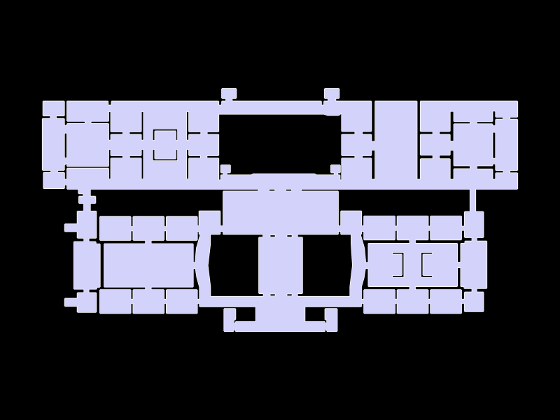
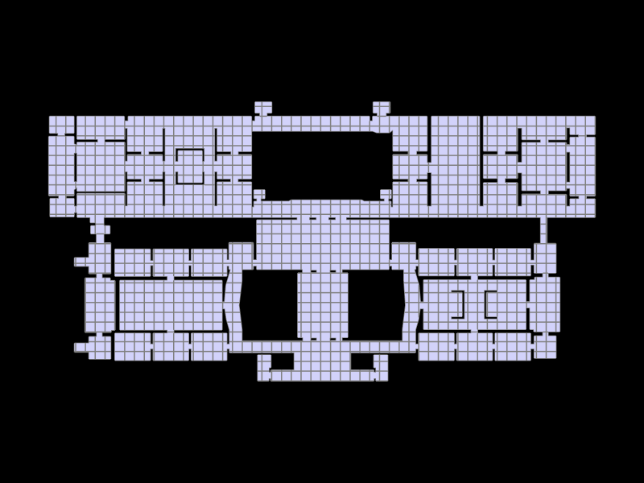
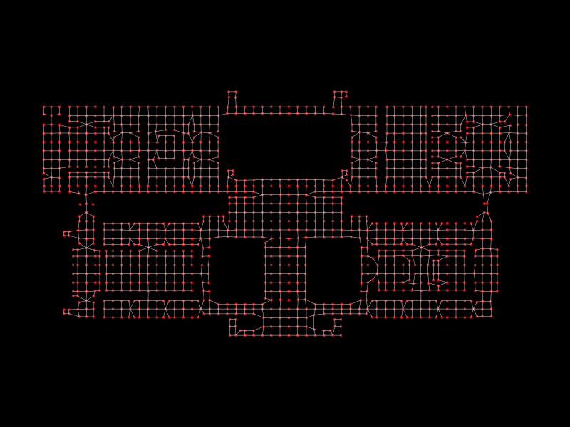
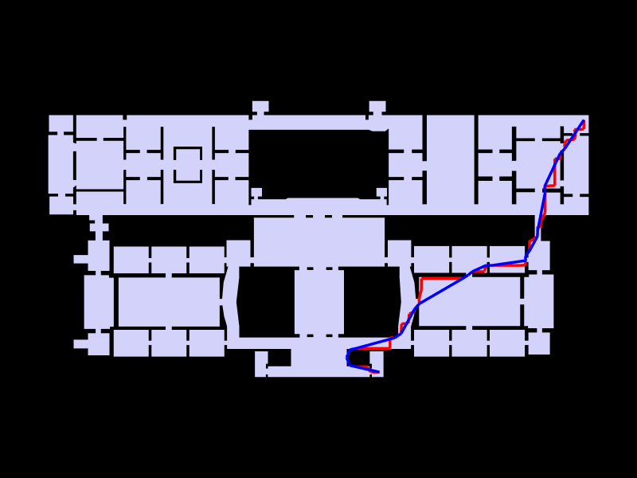
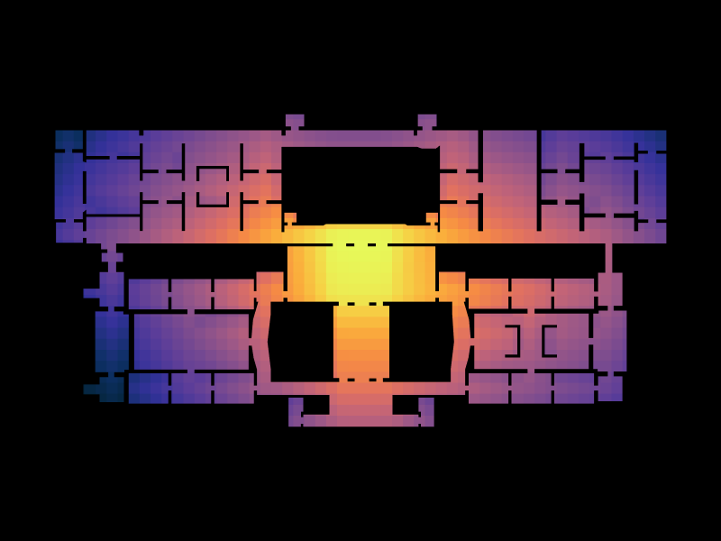
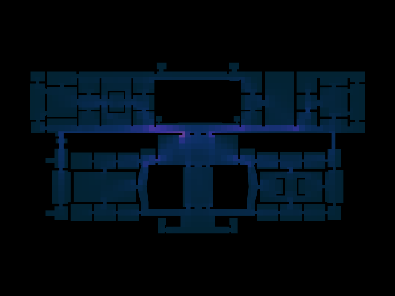
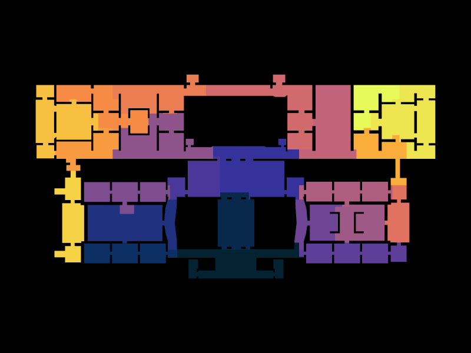
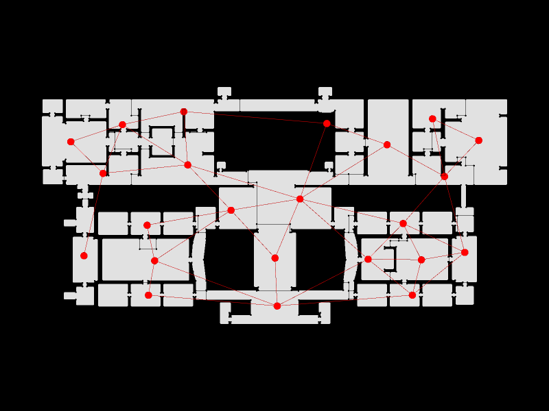
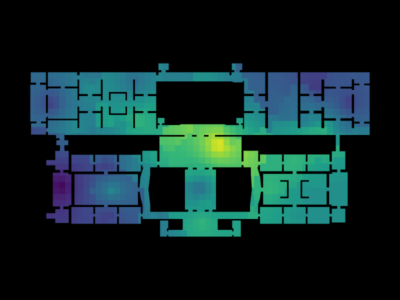

# GNAM Graph Based Analysis

## Introduction

This analysis applies graph-based spatial intelligence methods to understand the architectural and functional properties of the Galleria Nazionale d'Arte Moderna (GNAM) in Rome. Through topological and metric analysis, we examine how the building's layout facilitates or constrains movement, accessibility, and spatial interaction. The study combines geometric representations with network analysis to reveal both the intended symmetries of the design and the emergent asymmetries in spatial flow and connectivity.

## About GNAM - Rome

The Galleria Nazionale d'Arte Moderna (National Gallery of Modern Art) is located in Rome, Italy, and is housed in a purpose-built neoclassical structure in the Viale delle Belle Arti area. The museum is one of the most important collections of modern and contemporary art in Europe, featuring works from the 19th and 20th centuries. The building itself is an architectural achievement, characterized by its grand proportions, symmetrical layout, and carefully planned spatial organization designed to facilitate the circulation of visitors through its gallery spaces.

## Method

### 1. Original Floorplan

The original floorplan of GNAM reveals the building's fundamental spatial organization. The geometric outline shows the overall footprint and architectural boundaries that define the museum's spatial envelope. This representation establishes the baseline for all subsequent analyses.

### 2. Grid Overlay

A regular grid with 3-meter spacing is applied to discretize the continuous space into analyzable units. This grid transformation converts the complex architectural geometry into a regular matrix of cells, enabling quantitative analysis of spatial distribution. The grid serves as the foundation for deriving the navigation and analysis graphs, ensuring uniform sampling of the spatial domain while respecting the boundaries of the building.

**Results**: The grid creates 84 spatial cells that collectively cover the entire floorplan, providing a sufficient resolution for detailed spatial analysis while remaining computationally tractable.

### 3. Analysis Graph

The graph representation transforms the spatial cells into a network of nodes and edges, where nodes represent individual grid cells and edges represent adjacency relationships between neighboring cells. This topological abstraction captures the connectivity structure of the space, independent of actual distances or geometric properties.

**Results**: The analysis graph contains 84 vertices and 156 edges, forming a connected network where each space is reachable from every other space through a sequence of adjacent cells. This structure reveals the fundamental connectivity of the museum's layout.

### 4. Shortest Path Analysis

The shortest path analysis demonstrates the optimal routes through the building from one location to another. In this example, the path from the upper left gallery area to the central ground level requires approximately 127 meters of walking distance. The red line indicates the shortest topological path, while the blue line shows the straightened path after geometric optimization.

**Results**: Multiple shortest path queries reveal that the building's circulation is relatively efficient, with most gallery-to-gallery transitions achievable within 60-150 meters. However, certain spatial transitions between non-adjacent zones require substantial detours, indicating localized clustering of accessible areas.

### 5. Closeness Centrality (Integration)

Closeness centrality measures how close each space is to all other spaces in the network, represented by color gradients from cool (low integration) to warm (high integration) hues. High closeness centrality indicates globally accessible spaces that can reach all other areas efficiently with minimal hops.

**Results**: The analysis reveals a core zone of high integration (warm colors) concentrated in the central gallery spaces, with reduced integration toward the peripheral zones and upper levels. This indicates that the building's primary circulation routes converge on the central areas, making them natural gathering and transition points. Peripheral exhibition spaces have lower integration, suggesting they are more isolated and serve specialized curatorial purposes.

### 6. Betweenness Centrality (Choice)

Betweenness centrality identifies spaces that lie on the shortest paths between many other spaces. High betweenness indicates "chokepoint" locations that are strategically important for circulation, as many paths must pass through these areas. These spaces function as essential connectors within the network.

**Results**: A clear hierarchy of connector spaces emerges, with certain corridors and central gallery sections showing exceptionally high betweenness values. These strategic spaces are critical for circulation and would be most disrupted by congestion or barriers. The distribution is asymmetric, with some areas far more critical to overall flow than others, despite the building's relatively symmetric layout.

### 7. Community Detection

Community detection algorithms identify clusters of spaces that are more densely connected to each other than to the rest of the network. These communities often correspond to functional zones or galleries that share common circulation patterns and accessibility characteristics.

**Results**: The algorithm identifies 6-8 distinct community clusters within the building. These communities do not follow strict symmetrical divisions despite the building's geometric symmetry, indicating that functional accessibility creates emergent spatial groupings. Some communities span multiple physical galleries, while others subdivide single large spaces, demonstrating that topological connectivity differs from architectural compartmentalization.

### 8. Degree Centrality Graph

Degree centrality measures the number of direct connections (adjacent spaces) for each location. The graph representation uses vertex size and color to indicate degree values, with larger red vertices showing higher connectivity. This view emphasizes local connectivity independent of broader network effects.

**Results**: The graph visualization shows that central gallery spaces have significantly higher degree centrality than peripheral zones, indicating they offer more immediate movement choices to visitors. The distribution reveals clusters of high-connectivity spaces distributed throughout the building, suggesting multiple alternative routes and circulation options in well-designed gallery zones.

### 9. Degree Centrality (Spatial Heat Map)

The spatial heat map of degree centrality overlays connectivity values directly onto the floorplan using color gradients (viridis scale: purple for low connectivity, yellow for high connectivity). This representation directly links connectivity metrics to specific spatial locations, making it easy to identify well-connected versus isolated areas.

**Results**: The heat map reveals a non-uniform distribution of connectivity despite the building's architectural symmetry. Central axes show consistently high degree centrality, while certain wings and peripheral galleries exhibit lower connectivity. This asymmetry in local connectivity, combined with the symmetric architectural form, creates complex patterns of spatial experience and movement flow.

## Conclusions

### Symmetry vs. Asymmetry in Spatial Flow

The GNAM presents a fascinating case study in the disjunction between **architectural symmetry** and **functional asymmetry**. While the building's design exhibits strong geometric and compositional symmetry in its facade and overall planning, the graph-based analysis reveals significant asymmetries in spatial accessibility, connectivity, and circulation flow:

1. **Connectivity Asymmetry**: Despite symmetric plan geometry, the distribution of direct connections (degree centrality) is highly asymmetric, with certain zones offering significantly more movement options than others.

2. **Flow Concentration**: The centrality analyses demonstrate that circulation flow is concentrated along specific routes and through particular spaces. These chokepoints (high betweenness centrality) do not respect the architectural symmetry and indicate that visitor movement follows specific functional patterns rather than being equally distributed across symmetric alternatives.

3. **Isolation in Peripheral Zones**: Peripheral gallery spaces, even when architecturally equivalent to central galleries on opposite sides of the building, exhibit different accessibility characteristics. This suggests that the sequence of transitions through the building creates functional differentiation that transcends geometric symmetry.

4. **Community Formation**: The emergent community structure reveals that topologically defined spatial clusters do not align with symmetric architectural divisions, indicating that accessibility creates functional zones that supersede the intended symmetric organization.

### Implications for Curatorial and Visitor Experience

These asymmetries have significant implications for museum operation:
- **Congestion Points**: High-betweenness spaces will experience congestion during peak hours, regardless of architectural intentions
- **Exhibition Strategy**: Peripheral galleries with low integration may require enhanced curatorial emphasis or directional cues to attract visitor flow
- **Accessibility Planning**: Emergency egress and accessibility considerations must account for the actual flow patterns revealed by the network analysis, not merely the symmetric plan geometry

The analysis demonstrates that **spatial graphs reveal the true functional organization of complex buildings**, distinguishing between intended design symmetry and emergent operational asymmetry.
