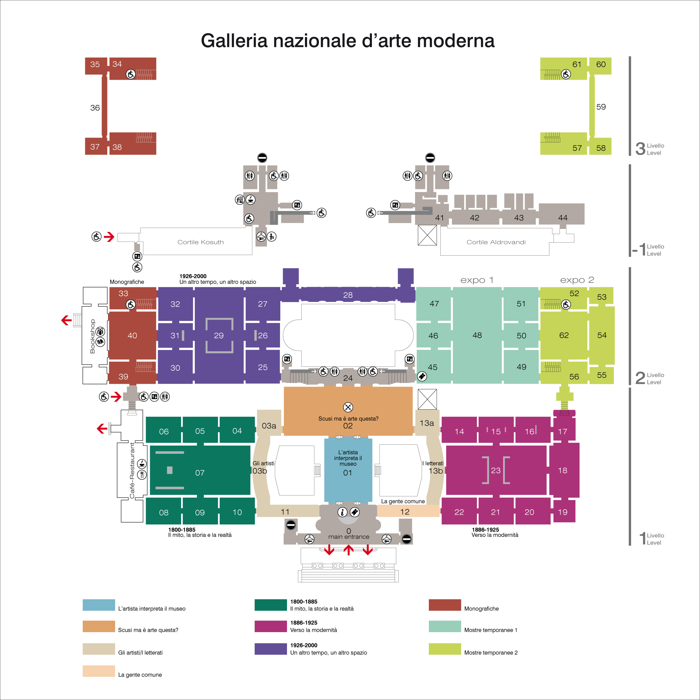
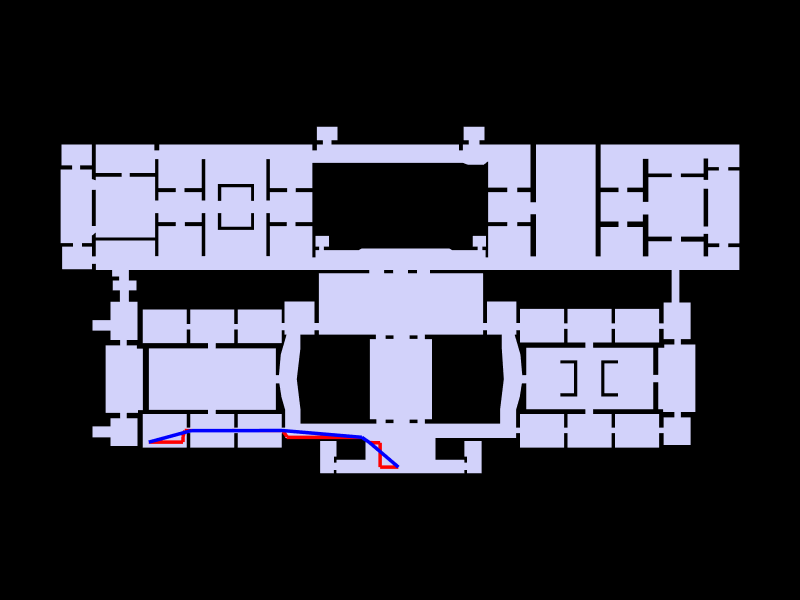
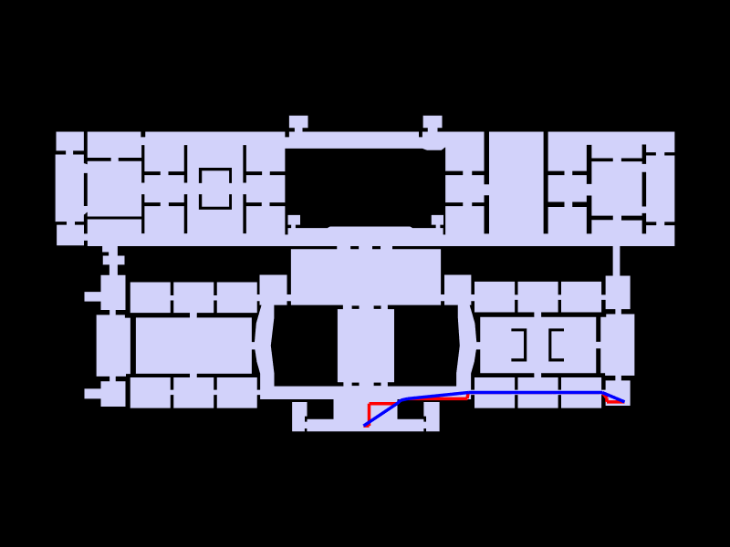
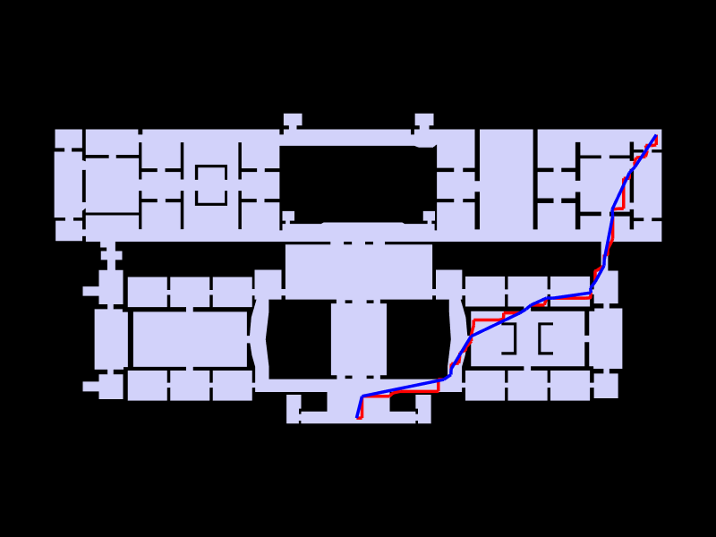
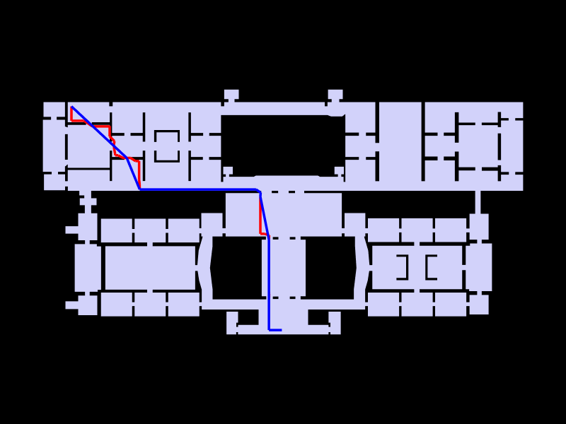

# GNAM Graph Based Analysis

## Introduction

This analysis applies graph-based spatial intelligence methods to understand the architectural and functional properties of the Galleria Nazionale d'Arte Moderna (GNAM) in Rome. Through topological and metric analysis, we examine how the building's layout facilitates or constrains movement, accessibility, and spatial interaction. The study combines geometric representations with network analysis to reveal both the intended symmetries of the design and the emergent asymmetries in spatial flow and connectivity.

## About GNAM - Rome

The Galleria Nazionale d'Arte Moderna (National Gallery of Modern Art) is located in Rome, Italy, and is housed in a purpose-built neoclassical structure in the Viale delle Belle Arti area. The museum is one of the most important collections of modern and contemporary art in Europe, featuring works from the 19th and 20th centuries. The building itself is an architectural achievement, characterized by its grand proportions, symmetrical layout, and carefully planned spatial organization designed to facilitate the circulation of visitors through its gallery spaces.

## Method

### 1. Floorplan & Grid Overlay

The floorplan has an overall area of 8277.8 m^2.

A regular grid with 3-meter spacing is applied to discretize the continuous space into analyzable units. The grid serves as the foundation for deriving the navigation and analysis graphs.

### 2. Analysis Graph

The analysis graph contains 1319 vertices and 2242 edges.

### 3. Shortest Path Analysis

The shortest path analysis demonstrates the optimal routes through the building from the four corners of the gallery (upper left, upper right, lower right, and lower left) to the main entrance. The red line indicates the shortest topological path, while the blue line shows the straightened path after geometric optimization.

**Results**: The upper corners show similar distances to the entrance (128m and 133m) despite different routes. The lower left corner is significantly closer to the entrance than the lower right corner.

### 4. Closeness Centrality (Integration)

Closeness centrality measures how close each space is to all other spaces in the network, represented by color gradients from cool (low integration) to warm (high integration) hues. High closeness centrality indicates globally accessible spaces that can reach all other areas efficiently with minimal hops.

**Results**: The analysis reveals a core zone of high integration (warm colors) concentrated in the central gallery spaces. Notably, the cafe/restaurant in the lower left corner shows low integration, indicating it is functionally separated from the main museum circulation. The lower left section is generally less accessible compared to the lower right, showing reduced integration.

### 5. Betweenness Centrality (Choice)

Betweenness centrality identifies spaces that lie on the shortest paths between many other spaces. High betweenness indicates "chokepoint" locations that are strategically important for circulation, as many paths must pass through these areas. These spaces function as essential connectors within the network.

**Results**: Higher betweenness values are concentrated in the lower part of the upper building body, where critical corridors and gallery sections form essential circulation nodes. The distribution is asymmetric, with certain areas more critical to overall flow than others, despite the building's symmetric layout.

### 6. Community Detection

Community detection algorithms identify clusters of spaces that are more densely connected to each other than to the rest of the network. These communities often correspond to functional zones that share common circulation patterns and accessibility characteristics.

**Results**: The algorithm identifies 23 distinct community clusters within the building. These communities do not follow strict symmetrical divisions despite the building's geometric symmetry, indicating that functional accessibility creates emergent spatial groupings. Some communities span multiple physical galleries, while others subdivide single large spaces, demonstrating that topological connectivity differs from architectural compartmentalization.

### 7. Degree Centrality

Degree centrality measures the number of direct connections (adjacent spaces) for each location (viridis scale: purple for low connectivity, yellow for high connectivity). This representation directly links connectivity metrics to specific spatial locations, making it easy to identify well-connected versus isolated areas.

**Results**: The heat map reveals a non-uniform distribution of connectivity despite the building's architectural symmetry. Central axes show consistently high degree centrality, while certain wings and peripheral galleries exhibit lower connectivity.

## Conclusions

### Symmetry vs. Asymmetry in Spatial Flow

The GNAM presents a fascinating case study in the disjunction between **architectural symmetry** and **functional asymmetry**. While the building's design exhibits strong geometric and compositional symmetry in its facade and overall planning, the graph-based analysis reveals significant asymmetries in spatial accessibility, connectivity, and circulation flow:

1. **Connectivity Asymmetry**: Despite symmetric plan geometry, the distribution of direct connections (degree centrality) is highly asymmetric, with certain zones offering significantly more movement options than others.

2. **Flow Concentration**: The centrality analyses demonstrate that circulation flow is concentrated along specific routes and through particular spaces. These chokepoints (high betweenness centrality) do not respect the architectural symmetry and indicate that visitor movement follows specific functional patterns rather than being equally distributed across symmetric alternatives.

3. **Isolation in Peripheral Zones**: Peripheral gallery spaces, even when architecturally equivalent to central galleries on opposite sides of the building, exhibit different accessibility characteristics. This suggests that the sequence of transitions through the building creates functional differentiation that transcends geometric symmetry. Peripheral galleries with low integration may require enhanced curatorial emphasis or directional cues to attract visitor flow

The analysis demonstrates that **spatial graphs reveal the true functional organization of complex buildings**, distinguishing between intended design symmetry and emergent operational asymmetry.
